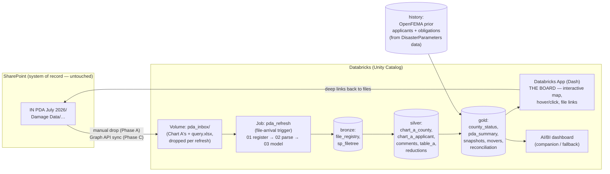

# PDA Board — a live PDA operations dashboard in Databricks

**Implementation plan · drafted 2026-07-18 (during the IN PDA July 2026 JPDA)**

> The product in one sentence: a Databricks-hosted live board for an **ongoing
> Preliminary Damage Assessment** — an interactive county map you watch like a
> game overview / stock ticker: hover a county for the critical rollup, click it
> for the full drill-down (applicants, categories, comments, threshold math) and
> direct links to that county's SharePoint files. Historical context ("prior
> applicants", "past obligations") is present but deliberately **not** the hero —
> the hero is *how the PDA is going right now*.

This plan is grounded in a real read of the example PDA artifacts in
`PDAExamples/` (Chart A workbooks, the Table A master tracker, and `query.xlsx`
— a SharePoint file-tree export of the actual `IN PDA July 2026` folder). Every
cell anchor, folder convention, and landmine below was verified against those
files on 2026-07-18.

---

## 0. Executive summary & the demo goal

**Audience:** your boss + the R5 PA leadership watching a live JPDA.
**Deadline pressure:** the PDA is running *this week*. The build order (§12) is
sequenced so a credible demo exists after ~1–2 working days, and each later
phase only makes it better.

What the boss sees on screen (the 3-minute demo, §12.3):

1. **The board** — Indiana county map, scope counties colored by status
   (Not started → Field in progress → Lead review → Ready for Table A →
   Entered in Table A), the rest of the state dimmed.
2. **Hover Decatur** — tooltip: validated $, % of county per-capita target,
   applicants complete/total, inspector, last touch.
3. **Click Decatur** — side panel: Cat A–G bar, applicant table with statuses
   and validation comments, threshold gauge, **clickable links to the county's
   SharePoint folder and each source document**, and a small "prior PA history
   in this county" strip.
4. **The ticker** — validated grand total climbing toward the state indicator
   ($13.16M for Indiana) across data refreshes; "movers since yesterday."
5. **KPI row** — % counties complete, counties ≥100% / ≥50% of county
   indicator, total applicants, PDA total vs threshold.

---

## 1. What the example PDA taught us (the data reality)

Everything the dashboard needs already exists in the PDA's working files. No
one has to change how they work — the dashboard is a **read-only lens** over
the SharePoint folder.

### 1.1 SharePoint anatomy (from `query.xlsx`)

```
…/PA Yellow Pages/3. PDAs/Ongoing PDA's/IN PDA July 2026/
├── Damage Data/
│   ├── Chart A's/                      ← the WORKFLOW pipeline
│   │   ├── (root)                      ← staged / in triage
│   │   ├── 1. For PDA Lead Review/     ← stage 2
│   │   └── 2. Ready for Table A/       ← stage 3
│   │       └── Entered in Table A/     ← stage 4 (terminal)
│   └── Counties/
│       ├── <County>/                   ← field working copies + source docs
│       │   ├── <County> Chart A - … .xlsx
│       │   ├── (invoices, RFIs, cost tracking sheets, photos, .msg)
│       │   └── FEMA Notes/             ← validation notes
│       └── REMCs/                      ← rural electric co-ops (multi-county
│           └── <REMC name>/               PNP applicants, pseudo-county)
├── Final Products/  Map Products/  Resources/  State Request/  Team Info/
└── (PDA map PDF, PDA 101 deck)
```

**Three load-bearing discoveries:**

1. **Workflow status is encoded in folder location.** A Chart A's position in
   the `Chart A's/` pipeline *is* its review stage. No one fills in a status
   field — the folder move is the status change. The dashboard derives stage
   from path.
2. **The county scope is the `Counties/` folder listing.** The example PDA has
   27 county folders + `REMCs/`. That's the authoritative "counties in this
   PDA" list (it mirrors the State Request).
3. **One PDA can span multiple incident periods.** This PDA has **two events**
   — *June 6–11, 2026* and *June 16–26, 2026* — with a separate Chart A per
   county × event (the event is in the filename parenthetical). Thresholds are
   evaluated **per event** (each may become its own declaration request), so
   the dashboard needs an event switcher: `Event 1 / Event 2 / Combined`.

`query.xlsx` itself (SharePoint's "Export to Excel" of the document library
view) carries `Name / Modified / Modified By / File Size / Item Type / Path`
for every file and folder — which gives us, for free: **stage** (path),
**freshness** ("last touch" per county), **who** touched it, and the raw
material for **SharePoint deep links**.

### 1.2 Chart A anatomy (one workbook per county × event)

Verified stable across a validated file (Floyd) and an in-progress file
(Decatur):

| What | Where | Example value |
|---|---|---|
| County + population + threshold | `County Summary!B3` | `Floyd County (80,484) - $391,152.24` |
| FEMA Inspector | `County Summary!D3` | (a name) |
| Emergency Work total (A+B) | `County Summary!E3` | `13110.95` |
| Permanent Work total (C–G) | `County Summary!G3` | `7591.47` |
| County total | `County Summary!L3` | `20702.42` |
| Applicant table header | `County Summary!B5` (`Applicant · Type · Status · A · B · C · D · E · F · G · Applicant Total`) | |
| Applicant rows | `B6:L…` until `Applicant` blank | `Floyd County Road Dept · County · Complete · 13110.95 · … · 20702.42` |
| Per-applicant comments | `Comments!A2:B…` (skip `0`/blank applicant rows) | `Category A: Applicant claimed…` |
| Creator | hidden `Notes` sheet | |
| Statewide county lookup + team leads | hidden `County Population and Threshold` sheet | pop, county PCI target per county |

Applicant `Status` values observed: `Complete`, `In Progress` (treat as an
open enum — normalize case, keep raw).

### 1.3 Table A anatomy (`IN PDA - July 2026.xlsx`, the master tracker)

- **`Summary`** — grand totals by Cat A–G with threshold tiers (`Did Not Meet
  Threshold`, `Met 100% Threshold`, `Met 50% Threshold`, `Validated Grand
  Total`), then a per-county table: `County · Population · Cat A–G · Total ·
  County PCI Target · % County PCI Target · Target` (status string like
  `Didn't Meet PCI Target`).
- **`Input Sheet`** — the entry grain is **subrecipient**: `Subrecipient ·
  County · Status · A–G`, plus PDA metadata: `State Code: IN`, `Population:
  6,785,528`, `State Per Capita: 1.94`, `County Per Capita: 4.86`, incident
  start/end, PDA start.
- **`Reductions`** (hidden) — `County · Applicant · Cat · Original · Eligible ·
  Reduction · Reduction Category · Notes`. Parse it when present: "what got
  reduced in validation and why" is exactly the kind of traceability an
  executive asks about.
- **`RVAR`** — the report sheet (timeline, indicators: small project min
  $4,100, large project threshold $1,093,800).

### 1.4 Landmines (all real, all observed)

1. **Filenames lie; cells don't.** Filled-in Chart A's still named
   `Blank Chart A - Indiana (…).xlsx` exist inside county folders (Delaware,
   Floyd). **County identity must come from `County Summary!B3`**, filename
   only as fallback. A file named "Blank" with an empty applicant table is a
   template → excluded from rollups (but listed on the Data Health page).
2. **Duplicates across stages.** The same county×event Chart A exists in
   `Counties/<County>/` (field copy) *and* in the `Chart A's/` pipeline.
   Canonical-record rule: **highest stage wins; tie → latest `Modified`.**
   Keep every version in silver with an `is_canonical` flag (the version trail
   is itself useful).
3. **Never trust the workbook's total columns.** Recompute
   `applicant_total = Σ(A..G)` and `county_total = Σ(applicants)`; reconcile
   against `L3`/per-row totals to $0.01 and **flag** mismatches rather than
   silently pick one. (Same conservation-audit ethos as DisasterParameters'
   `ihpAudit`.) Also: parse with `data_only=True` — if a workbook was saved
   without cached formula values, computed cells read `None`; recomputing from
   the raw A–G inputs sidesteps that entirely.
4. **The template is reused across states** (the RVAR title in the IN workbook
   literally says "WI PDA"; hidden lookup sheets carry MI and WI county
   tables). **Read state, population, and per-capita indicators from
   `Input Sheet`** — never hardcode. (Indicators change every Oct 1; this
   PDA's are $1.94 state / $4.86 county.)
5. **REMCs are not counties.** Rural electric co-op Chart A's live under
   `Counties/REMCs/` and their damage spans many counties
   (`indiana_remc_counties.xlsx` maps which). v1: model them as
   `entity_type='REMC'`, county `NULL` — shown in a "Non-county applicants"
   card, **not** allocated onto the map. v2 (optional): allocate via the
   mapping file, clearly labeled an estimate.
6. **Two events, one folder.** Every fact row carries `event_id`. A blank
   template like `Blank Chart A - Indiana (2026).xlsx` (no event parenthetical)
   → `event_id NULL`, excluded from event rollups.
7. **Naming is inconsistent** (`Carroll County Chart A - …`, `Decatur - …`,
   `Floyd - …`, `… Completed.xlsx`). The parser keys on **content**, treats the
   filename as metadata.

---

## 2. Architecture



**Design principles** (carried over from DisasterParameters, because they work):

- **Read-only lens.** The dashboard never writes to SharePoint and never asks
  the field team to change behavior. Folder moves they already do *are* the
  status updates.
- **Conservation audits over silent fixes.** Every dollar parsed either lands
  in a rollup or in a flagged bucket on the Data Health page. Totals must
  reconcile or say why not.
- **Config over code.** Folder→stage mapping, event list, county scope,
  SharePoint base URL, per-capita indicators — all small config tables/values,
  editable without touching the parser.
- **Snapshots make it a ticker.** Every refresh appends to an immutable
  snapshot table. The "watching your stocks" feel is just
  `validated_total` over `run_ts` — trivial to store, magic to watch.
- **Medallion, but small.** This is dozens of files, not big data. Simple
  Delta tables, one job, serverless where available. Don't over-engineer.

---

## 3. Unity Catalog layout

Adjust names to your workspace's conventions; structure is what matters.

```
Catalog:  recovery              (or your org's sandbox catalog)
Schema:   pda_ops
Volume:   /Volumes/recovery/pda_ops/pda_inbox/
Tables:   recovery.pda_ops.<table>   (all Delta)
App:      pda-board            (Databricks App, Dash)
Job:      pda_refresh          (file-arrival trigger on the volume)
```

Volume drop convention — **one folder per PDA** (the product is multi-PDA from
day one; `pda_id` is on every row):

```
pda_inbox/
└── IN_PDA_July_2026/
    ├── manifest.yaml            ← tiny, hand-written once (see §4.2)
    ├── filetree/query.xlsx      ← fresh SharePoint export, every refresh
    └── charts/                  ← Chart A + Table A .xlsx drops (any nesting)
```

Grant the working group `READ VOLUME` + `USE`/`SELECT` on the schema; the app's
service principal gets `SELECT` on gold. Nothing here is public.

---

## 4. Phase 1 — Ingestion (works today, manual; automated later)

### 4.1 The refresh SOP (the manual Phase-A loop, ~3 minutes)

1. In SharePoint, open the `IN PDA July 2026` library view that shows all
   items (flat, no folders) → **Export to Excel** → save as `query.xlsx`.
2. Select the `Chart A's/` folder (and Table A workbook) → **Download** (zip)
   — or copy from your synced OneDrive folder.
3. Drop both into the volume (`Catalog Explorer → Upload to volume`, or
   `databricks fs cp` from the synced folder — one CLI line you can put in a
   `.bat`).
4. The job's **file-arrival trigger** fires; ~1 minute later the board shows
   the new snapshot.

> The `.bat` + synced-OneDrive route means a refresh is: *right-click →
> export query.xlsx → double-click the bat*. Do it each morning and after
> lunch during PDA week; every run becomes a ticker point.

### 4.2 `manifest.yaml` — the per-PDA config (written once)

```yaml
pda_id: IN_PDA_July_2026
state: IN
sharepoint_base: https://<tenant>.sharepoint.com/   # prefix for Path → URL
events:
  - {event_id: E1, label: "June 6 - 11, 2026"}
  - {event_id: E2, label: "June 16 - 26, 2026"}
folder_stage_map:                                   # editable, not hardcoded
  "Entered in Table A": 4
  "2. Ready for Table A": 3
  "1. For PDA Lead Review": 2
  "Chart A's": 1
  "Validated": 3          # some teams use a Validated folder — same rank as ready
  "Counties": 1           # field working copies
```

### 4.3 Bronze tables

**`bronze_sp_filetree`** — `query.xlsx` parsed verbatim + derived columns:
`pda_id, name, path, item_type, modified_ts, modified_by, size_bytes,
stage (from folder_stage_map), county_folder (from /Counties/<x>/),
url (sharepoint_base + url-encoded path), export_ts (file mtime of query.xlsx
= the "data as of" stamp), run_ts`.

**`bronze_file_registry`** — every file found under `charts/`:
`pda_id, volume_path, filename, size_bytes, sha256, run_ts, matched_sp_path,
match_method, parse_status`.

**The join trick that makes manual drops work:** a dropped file loses its
SharePoint folder context (stage!). Recover it by matching each dropped file to
`bronze_sp_filetree` rows: exact `filename` match → if unique, done; if the
same filename exists in multiple folders (it will — that's the duplicate
landmine), disambiguate by `size_bytes`; still ambiguous → take the
highest-stage candidate and flag `match_method='ambiguous'` on the Data Health
page. So **`query.xlsx` is the source of truth for *where/when/who*, and the
dropped files are the source of truth for *what's inside*.**

---

## 5. Phase 2 — the Chart A parser

One Python module (`chart_a_parser.py`), unit-tested against the
`PDAExamples/` fixtures **before** it ever runs in Databricks. Runs in the job
via openpyxl (`data_only=True`) on serverless or a small cluster
(`%pip install openpyxl pyyaml`).

### 5.1 Extraction spec

```python
COUNTY_RE = re.compile(r"^(?P<name>.+?)\s*\((?P<pop>[\d,]+)\)\s*-\s*\$(?P<thresh>[\d,.]+)")
EVENT_RE  = re.compile(r"\((?P<label>[A-Za-z]+\s+\d{1,2}\s*-\s*(?:[A-Za-z]+\s+)?\d{1,2},\s*\d{4})\)")
CATS = list("ABCDEFG")

def parse_chart_a(path) -> dict:
    wb = openpyxl.load_workbook(path, data_only=True, read_only=True)
    ws = wb["County Summary"]
    header = COUNTY_RE.match(str(ws["B3"].value or ""))     # county, pop, threshold
    inspector = ws["D3"].value
    summary = {"emergency": ws["E3"].value, "permanent": ws["G3"].value,
               "total": ws["L3"].value}                      # reconcile-only, never displayed
    applicants = []
    for row in ws.iter_rows(min_row=6, min_col=2, max_col=12):   # B..L
        name = row[0].value
        if name in (None, "", 0): break
        cats = {c: float(row[3 + i].value or 0) for i, c in enumerate(CATS)}  # E..K
        applicants.append({
            "applicant": str(name).strip(),
            "type": row[1].value, "status_raw": row[2].value,
            **cats, "total_calc": round(sum(cats.values()), 2),
        })
    comments = read_comments(wb)          # Comments!A2:B…, skip 0/blank applicant
    return {..., "event_label": event_from_filename_or_none(path)}
```

Rules already justified in §1.4: county from the cell (filename fallback),
totals recomputed, template files excluded, `event_id` resolved against the
manifest's event list (fuzzy on spacing: `June 6 - 11` ≡ `June 6-11`).

Also parse, when present in the drop:

- **Table A workbook** → `silver_table_a_county` (Summary per-county A–G +
  entered totals) and `silver_table_a_subrecipient` (Input Sheet rows) and
  `silver_reductions` (hidden Reductions sheet). Detection: workbook has an
  `Input Sheet` + `RVAR` sheet.
- **Nothing else.** Invoices, PDFs, cost-tracking sheets are *listed* (via the
  filetree) and *linked*, never parsed. That keeps the pipeline robust and the
  scope honest.

### 5.2 Silver tables

```
silver_chart_a_county      pda_id · event_id · county · entity_type(county|REMC)
                           · population · county_threshold · inspector
                           · emergency_calc · permanent_calc · total_calc
                           · wb_total (as-written, for reconciliation)
                           · source_file · sp_path · stage · modified_ts
                           · modified_by · is_canonical · run_ts
silver_chart_a_applicant   + applicant · applicant_type · status_raw
                           · status_norm(complete|in_progress|blank)
                           · cat_a … cat_g · total_calc · comment
silver_table_a_county      pda_id · county · cat_a…g · total_entered
silver_table_a_subrec      pda_id · county · subrecipient · status · cat_a…g
silver_reductions          pda_id · county · applicant · cat · original
                           · eligible · reduction · reduction_category · notes
```

### 5.3 Golden tests (fixtures = the example files)

- Floyd E1 → county `Floyd County`, pop 80,484, threshold $391,152.24, one
  applicant `Complete`, total **$20,702.42**, emergency $13,110.95 /
  permanent $7,591.47, and `total_calc == wb_total` to the cent.
- Decatur E1 → one applicant `In Progress`, total $0, a comment present.
- A `Blank Chart A - Indiana (2026).xlsx` → classified `template`, excluded.
- The Delaware "Blank"-named-but-real file → county resolved from B3.
- Benton appears in two folders → exactly one `is_canonical=1`, the
  higher-stage one.

---

## 6. Phase 3 — the status engine & gold model

### 6.1 County status (the map color) — per `county × event`

Two independent signals, combined by **max severity of progress**, both shown
in the drill-down so nobody argues with the map:

| Rank | Status (map color) | From folder stage | From content |
|---|---|---|---|
| 0 | **Not started** | no Chart A anywhere for this county×event | — |
| 1 | **Field in progress** | file only in `Counties/<x>/` or Chart A's root | any applicant, $0 or statuses open |
| 2 | **Lead review** | in `1. For PDA Lead Review/` | — |
| 3 | **Validated — ready for Table A** | in `2. Ready for Table A/` (or `Validated/`) | all applicant rows `Complete` |
| 4 | **Entered in Table A** | in `Entered in Table A/` | county present in Table A workbook |

Plus an orthogonal money badge per county×event:
`≥100% of county indicator` / `≥50%` / `under` / `$0` (county indicator =
population × county per-capita from `Input Sheet`).

### 6.2 Gold tables

```
gold_county_status    pda_id · event_id · county · fips · status_rank · status
                      · validated_total · pct_of_county_target · money_tier
                      · applicants_n · applicants_complete_n · inspector
                      · emergency · permanent · cat_a…g
                      · last_touch_ts · last_touch_by · files_n · sp_folder_url
gold_pda_summary      pda_id · event_id · validated_total · state_threshold
                      · pct_of_state_threshold · counties_total/started/complete
                      · counties_met_100 · counties_met_50 · applicants_n/complete
gold_applicant_detail (denormalized silver applicants, canonical only — feeds
                       the click-through panel and CSV export)
gold_snapshot         run_ts · everything in gold_county_status + pda_summary
                      (append-only — THE TICKER)
gold_movers           county · event · Δ validated_total · Δ status_rank
                      · Δ applicants_complete since previous snapshot
gold_reconciliation   county × event: chart_a_total vs table_a_total vs
                      wb_total · deltas · flags (the conservation audit)
gold_file_directory   every SharePoint item under the county's folders:
                      county · name · type icon · modified · by · url
                      (feeds "access the files" in the click panel)
dim_county            state · county · fips · population · centroid lat/lon
                      (seeded from the workbook's hidden lookup + Census FIPS;
                       one-time CSV, 92 IN rows — extendable to all R5 states)
```

`gold_reconciliation` is quietly the most boss-impressive table: *"Chart A says
Morgan validated $X; Table A has $Y entered — here's the $Z gap"* catches
transcription errors during the PDA, which is exactly when they're cheap to fix.

---

## 7. Phase 4 — the Board (the interactive map app) 🎯

### 7.1 Why a Databricks App (and the fallback)

The hover-rollup + click-through-to-files experience needs real interactivity.
AI/BI dashboards' map widget can cross-filter on click, but it can't render a
county click as a rich panel with external file links. So:

- **Primary: Databricks App** — Python **Dash** app (Databricks has a Dash
  template; Streamlit works too but Dash's callback model fits
  map-click → panel better). App service principal reads gold via SQL
  warehouse. All compute stays inside the workspace; auth is workspace SSO.
- **Fallback (if Apps aren't enabled in your workspace): AI/BI dashboard**
  (§7.5) — you lose the in-map click panel but keep hover tooltips,
  cross-filter drill tables, and clickable link columns. Check Apps
  availability **first thing Day 1** (Compute → Apps); it decides the track.
- **Escape hatch you already know how to build:** a self-contained
  `board.html` generated by the job (baked JSON + vanilla JS, exactly the
  DisasterParameters pattern), stored in the workspace and opened in a
  browser. Zero new platform dependencies; 100% within your demonstrated
  skill set. Keep in the back pocket.

### 7.2 Layout

```
┌────────────────────────────────────────────────────────────────────────┐
│ PDA BOARD · IN PDA July 2026      [Event 1 | Event 2 | Combined]       │
│ data as of: Jul 18 07:42 (query export) · refreshed 5 min ago          │
├──────────────┬─────────────────────────────────────────────────────────┤
│ KPI RAIL     │                                       ┌───────────────┐ │
│ $ validated  │        INDIANA COUNTY MAP             │ COUNTY PANEL  │ │
│ ▓▓▓▓░░ 62%   │   (choropleth: status or % target,    │ (on click)    │ │
│ of $13.16M   │    scope counties bold, rest dimmed;  │ status ● 3    │ │
│ 14/27 ready  │    REMC chip row below the map)       │ $ vs target ▓ │ │
│ 5 ≥100% PCI  │                                       │ Cat A–G bars  │ │
│ 3 ≥50%       │   [color by: Status | % to target]    │ applicant tbl │ │
│ 41 applicants│                                       │ comments      │ │
├──────────────┴───────────────────────────────────────│ 📁 FILES      │ │
│ TICKER: validated $ by snapshot ── movers since prev │  (SP links)   │ │
│ ┌ county table (sortable mirror of the map) ┐        │ prior history │ │
└────────────────────────────────────────────────────────────────────────┘
```

### 7.3 The map

- **Geometry:** Census cartographic boundary GeoJSON (20m), filtered to the
  state FIPS, stored **in the volume** (no runtime internet dependency —
  assume egress may be blocked). Join on `dim_county.fips`.
- **Hover template** (the "critical rollup"):

  ```
  Decatur County                       ● Validated — ready for Table A
  Validated: $128,400   (99.8% of $128,654 county target)
  Applicants: 3 of 4 complete · Inspector: <name>
  Last touch: Jul 17 09:36 by <name>
  ```

- **Click →** populates the right panel via one callback
  (`clickData → county`): status + stage trail (field → review → ready →
  entered, with dates), threshold gauge, Cat A–G bar, applicant table
  (name · type · status · $ · comment on expand), reductions if any, then the
  **file section** — `gold_file_directory` rows for that county: 📊/📄/📷 icon,
  name, modified, *by*, each an `<a target="_blank">` to SharePoint. One more
  link: **"Open county folder in SharePoint"**.
- **Color modes** (toggle): *Status* (categorical — the game-overview default)
  and *% to county target* (sequential — the money view). Non-scope counties:
  light gray, non-interactive.
- **REMC chip row** under the map (they're real applicants, not counties):
  chip → same click panel.

### 7.4 The ticker & movers

- Line/area of `gold_snapshot.validated_total` per event vs the state
  threshold line — the "stock chart."
- "Movers" list from `gold_movers`: `Porter +$84k · Morgan → Entered in
  Table A · Steuben +2 applicants complete` — computed as snapshot deltas, so
  it's automatically "what changed since I last looked."

### 7.5 AI/BI fallback spec (only if Apps are unavailable)

Pages: **Overview** (counters + point-map colored by status, sized by
validated $, hover tooltips), **Counties** (table with link column to SP
folders; map click cross-filters it), **Applicants**, **Reconciliation**,
**Data Health**. Everything reads the same gold tables — building this second
surface is ~2 hours, so consider shipping it *anyway* as the
no-maintenance/mobile companion.

---

## 8. Phase 5 — historical context (present, not the hero)

Exactly two cards in the county click panel, both sourced from data this repo
already ships (upload the committed JSONs to the volume; no OpenFEMA egress
needed from Databricks):

1. **Prior PA applicants here** — from `data/planner_applicants.json`
   (per-disaster applicant×county grain): "Decatur County has had 9 PA
   applicants across 3 disasters; median $412k/disaster" + expandable list.
2. **Obligation history** — from `data/county_declarations.json`:
   declarations count, PA obligated, IHP approved for the county.

Load once into `hist_prior_applicants` / `hist_county_obligations` keyed by
FIPS. Later (optional): refresh directly from OpenFEMA if the workspace has
egress. Label both cards with source + "context only — not a projection."

---

## 9. Phase 6 — automation roadmap (SharePoint sync)

| Phase | Mechanism | Effort | When |
|---|---|---|---|
| **A (this week)** | Manual drop SOP (§4.1) + **file-arrival trigger** on the volume — automation *inside* Databricks is already total: drop files, everything else is hands-off | done in Phase 1 | now |
| **B** | Scheduled job + `.bat`/PowerShell from the synced OneDrive folder (`databricks fs cp --recursive`) — semi-auto, runs from your laptop | ~1 hr | week 2 |
| **C** | **MS Graph API sync job**: app registration (Sites.Selected → just this site), job pulls delta changes of the PDA library → volume → refresh. Note gov-cloud endpoints (`graph.microsoft.us`) if you're on GCC-High. This also replaces `query.xlsx` (Graph gives the same metadata, fresher). | 1–2 days + an IT/app-registration conversation | when the product earns it |
| C′ (alternative) | Power Automate flow (SharePoint trigger → Azure blob → UC external location) if Graph app registration is politically harder than a Power Automate license | 
| — | 1–2 days |

Design note: because Phase A already lands files in the same volume layout that
Phase C would, **nothing downstream changes when you automate** — the trigger
just fires more often.

---

## 10. Data quality & trust gates (the Data Health page)

Shown in the app (small, bottom tab) — every anomaly visible, nothing silent:

- Parse failures (file, error), unmatched drops (no filetree row), ambiguous
  stage matches (§4.3).
- Reconciliation breaks: `Σcats ≠ row total`, `Σapplicants ≠ county summary`,
  `Chart A ≠ Table A` (from `gold_reconciliation`), each with $ delta.
- Template/"Blank"-named files carrying data (naming hygiene nudges).
- Stale counties: in scope, status < 3, no touch in 48h — **sorted by
  county threshold desc** (chase the money).
- `query.xlsx` export age > 24h → banner on the board ("data as of" goes
  amber), so a stale manual refresh can't masquerade as live truth.

Job-level gate (mirrors this repo's Guardian ethos): if > N% of Chart A's fail
to parse, the job marks the run degraded and the board shows the previous
snapshot with a warning banner — never a half-parsed board.

---

## 11. Governance & sensitivity

- Internal-only: workspace group grants; app shared to the PA team, not
  account-wide. No public endpoints.
- Content is PA/applicant-grain (governments + PNPs) — no survivor PII. The
  county source folders can contain semi-sensitive docs (invoices, .msg): we
  **link, never ingest** their contents; the dashboard stores names/paths only.
- Staff names (inspectors, modified-by) appear — fine internally; keep them
  out of any exported/screenshot artifact that leaves the team.
- This is a **descriptive status tool**, not an eligibility or declaration
  recommendation — keep a one-line footer to that effect (the Stafford-Act
  version of this repo's non-endorsement disclaimer; it also protects the
  product politically).

---

## 12. Build order — day-by-day

Today is **Fri Jul 18**; the PDA is live now. Optimize for a Monday demo.

### Day 0 — Fri PM (~3 hrs) · "data flows"
- [ ] Confirm workspace facts (15 min, decides everything): Apps enabled?
      serverless jobs? volume upload rights? catalog to use?
- [ ] Create catalog/schema/volume; upload `PDAExamples/` as the first drop.
- [ ] Write `chart_a_parser.py` + golden tests **locally against the fixtures**
      (fastest possible iteration; the module then runs unchanged in the job).
- [ ] Notebook 01+02: filetree parse, registry, filename↔filetree join,
      silver tables populated from the examples.

### Day 1 — Sat (~4 hrs) · "the model is right"
- [ ] Seed `dim_county` (pop from workbook hidden sheet + FIPS + centroids);
      stage/status engine; gold tables; first `gold_snapshot`.
- [ ] Reconciliation + Data Health queries.
- [ ] Job wiring: 01→02→03 with file-arrival trigger; test with a re-drop
      (snapshot #2 appears → ticker exists).

### Day 2 — Sun (~4–6 hrs) · "the Board"
- [ ] Dash app: map + hover (7.3), KPI rail, event switcher.
- [ ] Click panel: county detail + applicant table + **file links**.
- [ ] Ticker + movers. FEMA navy/gold + Public Sans (reuse your palette).
- [ ] (If Apps unavailable: build §7.5 AI/BI dashboard instead — same day.)

### Mon AM · "go live on real data"
- [ ] Fresh export from the real SharePoint folder → drop → snapshot on live
      data. Sanity-check 2–3 counties against the actual Chart A's by hand.
- [ ] Demo (script below). Refresh again after lunch → the ticker moves
      *during the day you demo it*.

### Tue–Fri · harden while the PDA runs
- [ ] Table A reconciliation card · history cards (§8) · Data Health polish ·
      morning/afternoon refresh habit · collect boss feature requests.

### 12.3 The 3-minute demo script
1. *"This is the PDA right now"* — map, KPI rail. One sentence on statuses.
2. Hover 2 counties (one green, one stale-red). *"Hover is the rollup."*
3. Click Decatur → panel → **click a real invoice link** → SharePoint opens.
   *"Every number traces to the file it came from."*
4. Ticker: *"Each bar is a refresh — here's validated dollars climbing toward
   the $13.2M state indicator, and here's what moved since yesterday."*
5. Close on Reconciliation: *"It also checks Chart A against Table A, so
   transcription errors surface while they're still cheap."*

---

## 13. Risks & mitigations

| Risk | Mitigation |
|---|---|
| Databricks Apps not enabled / not in your workspace tier | Decide Day 0; fallback AI/BI (§7.5) keeps 80% of value; `board.html` escape hatch keeps ~95% at cost of hosting-in-workspace-files awkwardness |
| Egress blocked (GeoJSON, OpenFEMA) | Everything ships in the volume: GeoJSON, history JSONs. Zero runtime internet dependencies by design |
| Chart A template drifts (new column, moved anchor) | Golden tests + parse-failure gate (§10): a drift is a loud red run, never silently wrong numbers |
| `query.xlsx` export forgotten → stale stage/freshness | Export-age banner (§10); Phase C removes the manual step entirely |
| Same-name files mismatch to wrong filetree row | size tiebreak + `ambiguous` flag surfaced on Data Health |
| Boss asks "so will it hit the threshold?" | Out of scope by design — this is a facts board. The county-indicator tiers + ticker *show* trajectory without claiming a forecast (same posture as the DisasterParameters estimator caveat) |
| Multi-PDA future | `pda_id` on every row + per-PDA volume folders from day one; the app gets a PDA picker when there's a second one |

---

## 14. Parked ideas (log, don't build)

- REMC damage allocation to counties via `indiana_remc_counties.xlsx`
  (labeled estimate).
- Per-inspector workload view (assignments from the hidden team-leads sheet).
- IA-side PDA support (this plan is PA-only, matching the Chart A grain).
- Push alerts (SQL Alerts → email/Teams: "county hit 100% of indicator",
  "no refresh in 24h").
- Auto-generated end-of-PDA summary export (the RVAR sheet, but from gold).
- Graph-API live mode (§9 Phase C) + retiring `query.xlsx`.
